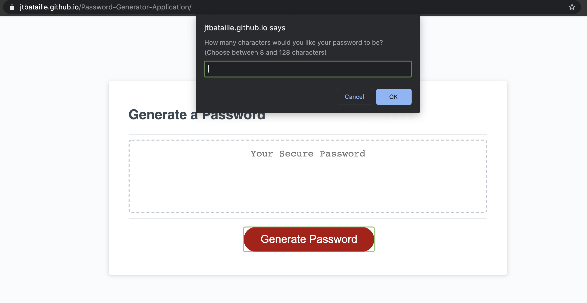
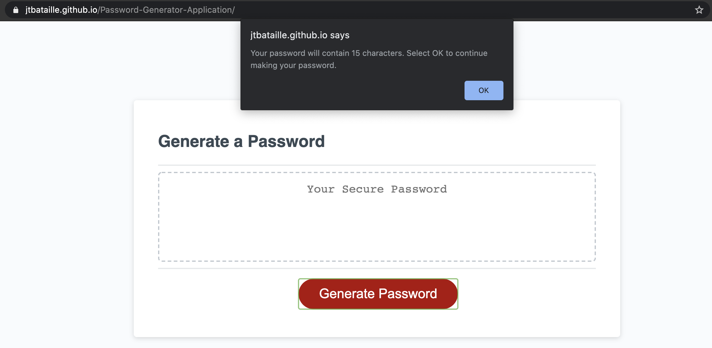
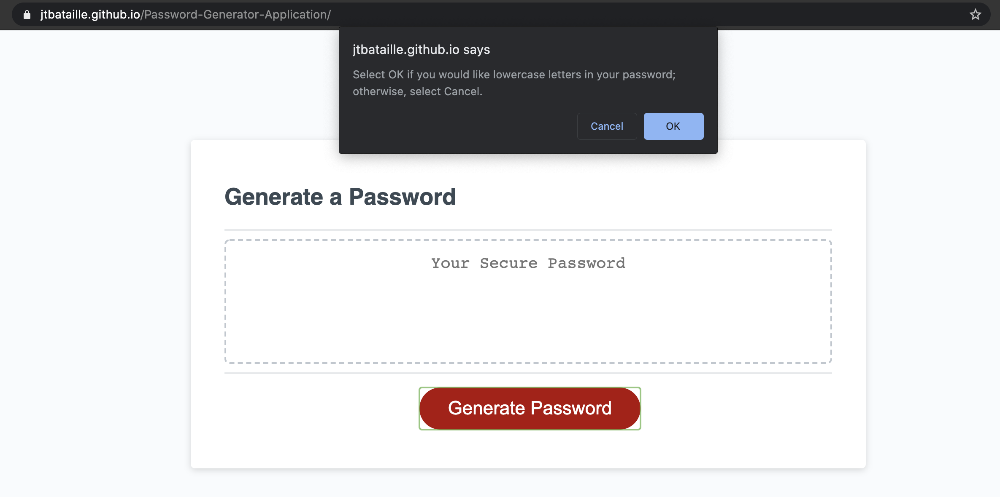
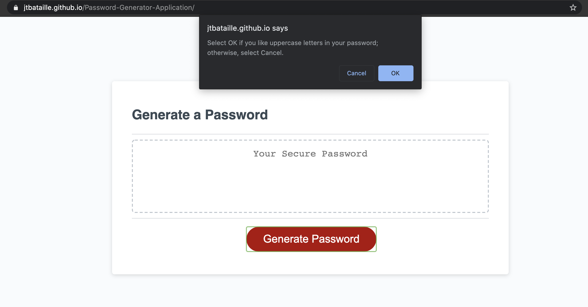
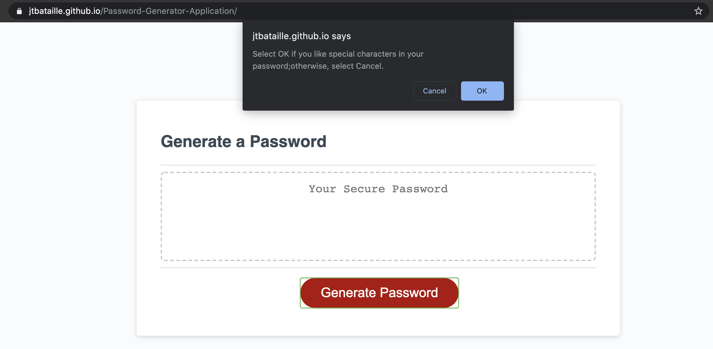
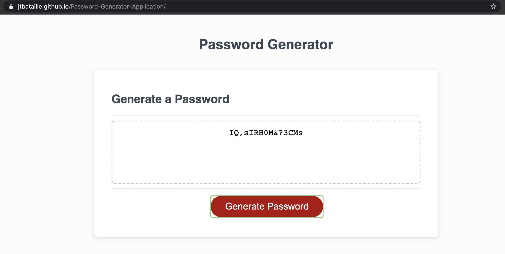

# Password Generator

## Table of Contents
* [Description](#description)
* [Installation](#description)
* [Technologies Used](#technologies-used)
* [Tests](#tests)
* [Application Demo](#application-demo)
* [Contact Information](#contact-information)

## Description
The Password Genertor uses JavaScript Alerts and Prompts to gleen a password based on a user's wishes. The user will be asked five (5) total questions: password length, lowercase characters (Y/N), uppercase characters (Y/N), numbers (Y/N), and special characters (Y/N), with a requirement of between 8 and 129 characters, as well as one of the remaining options.

## Installation
In order to use this application, a user can access the deployed generator at this application link: [Deployed Application Link](https://jtbataille.github.io/Password-Generator-Application/)

## Technologies Used
HTML, CSS, JavaScript

## Application Demo

## Contact Information
* Jarrod Bataille
  * Portfolio Webpage: https://jtbataille.github.io/
  * GitHub Profile: https://github.com/jtbataille
  * E-mail Address: jtbataille@gmail.com
  
- - -
Copyright © 2007 Free Software Foundation, Inc. <https://fsf.org/>
